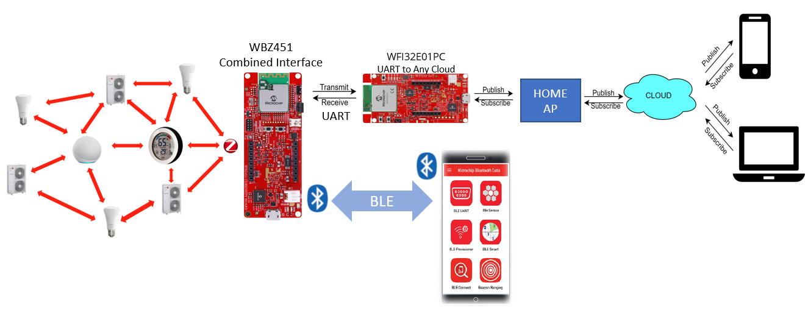
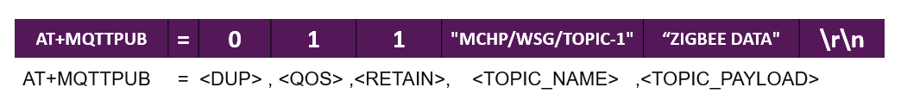

# PIC32CXBZ2_WBZ45x ZIGBEE to AnyCloud 


> "IoT Made Easy!" 

Devices: **| PIC32CXBZ2 | WBZ45x | PIC32MZ-W1 | WFI32 |**<br>
Features: **| ZIGBEE | WiFi | BLE |**


## ⚠ Disclaimer

<p><span style="color:red"><b>
THE SOFTWARE ARE PROVIDED "AS IS" AND GIVE A PATH FOR SELF-SUPPORT AND SELF-MAINTENANCE. This repository contains example code intended to help accelerate client product development. </br>

For additional Microchip repos, see: <a href="https://github.com/Microchip-MPLAB-Harmony" target="_blank">https://github.com/Microchip-MPLAB-Harmony</a>

Checkout the <a href="https://microchipsupport.force.com/s/" target="_blank">Technical support portal</a> to access our knowledge base, community forums or submit support ticket requests.
</span></p></b>

## Contents

1. [Introduction](#step1)
1. [Bill of materials](#step2)
1. [Software Setup](#step3)
1. [Hardware Setup](#step4)
1. [Harmony MCC Configuration](#step5)
1. [Board Programming](#step6)
1. [Run the demo](#step7)

## 1. Introduction<a name="step1">

This application demonstrate on how to interface a Zigbee network to Cloud using WBZ451 and WFI32 devices by passing the AP credentials via MBD(Microchip Bluetooth Data) application in mobile phone . In this Demo, the WBZ451 Curiosity board acts as a Zigbee Combined Interface device that can communicate with Zigbee end devices and routers in the network. The [PIC32MZW1_AnyCloud](https://github.com/MicrochipTech/PIC32MZW1_AnyCloud) application running in WFI32-IoT Development Board acts as a cloud gateway that can send and receive data from the Zigbee network to the any cloud. On startup the WBZ451 device initializes the WiFi and Cloud connection on WFI32 device via AT commands after BLE provisioning is completed using MBD app . On successful initialization, the [Zigbee console commands](https://onlinedocs.microchip.com/pr/GUID-A5330D3A-9F51-4A26-B71D-8503A493DF9C-en-US-2/index.html?GUID-BA19A3F8-CCEB-44C2-B5BF-C203DD6A8D41) have been mapped to Cloud. With the help of console commands, the user can allow new devices to join the Zigbee network as well as monitor and control the devices in the Zigbee network through Cloud.
 


| Tip | Go through the [overview](https://onlinedocs.microchip.com/pr/GUID-A5330D3A-9F51-4A26-B71D-8503A493DF9C-en-US-2/index.html?GUID-668A6CB2-F1FB-438D-9E1E-D67AC3C1C132) for understanding few key Zigbee 3.0 protocol concepts |
| :- | :- |

## 2. Bill of materials<a name="step2">

| TOOLS | QUANTITY |
| :- | :- |
| [PIC32CX-BZ2 and WBZ451 Curiosity Development Board](https://www.microchip.com/en-us/development-tool/EV96B94A) | 3 |
| [WFI32-IoT Development Board](https://www.microchip.com/en-us/development-tool/EV36W50A) | 1 |

## 3. Software Setup<a name="step3">

- [MPLAB X IDE ](https://www.microchip.com/en-us/tools-resources/develop/mplab-x-ide#tabs)

    - Version: 6.10
	- XC32 Compiler v4.10
	- MPLAB® Code Configurator v5.1.17
	- PIC32CX-BZ_DFP v1.0.107
	- MCC Harmony
	  - csp version: v3.13.1
	  - core version: v3.11.1
	  - CMSIS-FreeRTOS: v10.4.6
	  - dev_packs: v3.13.0
	  - wolfssl version: v4.7.0
	  - crypto version: v3.7.6
	  - wireless_pic32cxbz_wbz: v1.1.0
	  - wireless_zigbee: v5.0.0

- Any MQTT cloud application like [MyMQTT](https://mymqtt.app/)

- [MPLAB X IPE v6.10](https://microchipdeveloper.com/ipe:installation)

## 4. Hardware Setup<a name="step4">

- Connect the WFI32-IoT Development Board with the WBZ451 Curiosity Board using the connections described in the following table.  

|WBZ451|WFI32|Description |WBZ451|WFI32|Description|
| :- | :- | :- | :- |:- | :- |
|AN|NC|NC|PWM|NC|NC|
|RST|NC|NC|INT|NC|NC|
|CS|NC|NC|RX|TX|USART TX|
|SCK|NC)|NC|TX|RX|USART RX|
|MISO|NC|NC|SCL|NC|NC|
|MOSI|NC|NC|SDA|NC|NC|
|3.3V|NC|NC|5V|NC|NC|
|GND|NC|NC|GND|GND|GROUND|

## 5. Harmony MCC Configuration<a name="step5">

### Getting started with ZigBee MQTT application in WBZ451 Curiosity board 

| Tip | New users of MPLAB Code Configurator are recommended to go through the [overview](https://onlinedocs.microchip.com/pr/GUID-1F7007B8-9A46-4D03-AEED-650357BA760D-en-US-6/index.html?GUID-B5D058F5-1D0B-4720-8649-ACE5C0EEE2C0) |
| :- | :- |

**Step 1** - Connect the WBZ451 CURIOSITY BOARD to the device/system using a micro-USB cable.

**Step 2** - Create a [new MCC Harmony project](https://github.com/MicrochipTech/EA71C53A/blob/master/H3/wireless_apps_pic32cxbz2_wbz45/apps/docs/creating_new_mplabx_harmony_project.md#creating-a-new-mcc-harmony-project).

**Step 3** - The "MCC - Harmony Project Graph" below depicts the harmony components utilized in this project.


- In Device resources, go to Wireless->Drivers->Zigbee->Device types and select Combined Interface. Accept Dependencies or satisfiers, select "Yes". The Combined Interface configuration is depicted as follows.


- Add UART components needed for console logs and commands. Right click on the "⬦" in Zigbee console and add the satisfier and in the same way add SERCOM1 to the USART console. 

- The SERCOM1 UART configuration is depicted as follows.


- From Device resources, go to Library->Harmony->Wireless->Drivers->BLE and select BLE Stack. Accept Dependencies or satisfiers, select "Yes" for automatic connections. Follow the configurations illustrated in the following figure.


- From Device resources, go to  Library->Harmony->Wireless->Drivers->BLE->Services and select Custom Service. Accept Dependencies or satisfiers. The configuration is depicted as follows.


- From Device resources, go to Library->Harmony->Peripherals->SERCOM and select SERCOM0. The configuration is depicted as follows.


- The SYSTEM configuration is depicted as follows.


- From project graph, go to Plugins->PIN configuration and configure as follows.


**Step 4** - [Generate](https://onlinedocs.microchip.com/pr/GUID-A5330D3A-9F51-4A26-B71D-8503A493DF9C-en-US-1/index.html?GUID-9C28F407-4879-4174-9963-2CF34161398E) the code.
 
**Step 5** - In "app_user_edits.c", make sure the below code line is commented 

- "#error User action required - manually edit files as described here".

**Step 6** - Copy the mentioned files from this repository by navigating to the location mentioned below and paste it your project folder. 

| Note | This application repository should be cloned/downloaded to perform the following steps. |
| :- | :- |
| Path | firmware/src |

- Copy the "WFI32" folder, "app_ble" folder, "app.c" and "app.h" which can be found by navigating to the following path: "...\firmware\src"
- Paste the folder under source files in your project folder (...\firmware\src).

**Step 7** - Add the files in MPLAB X IDE to your project by following the steps mentioned below.

- In Projects section, right click on Source files to add the ".c" file and Header files to add the ".h" file.
- Select "Add existing items from folder".
- Select Add and browse the location of "WFI32" folder (...\firmware\src).
- Make sure the "Files of type" is "C Source files" while adding ".c" files and "Header files" while adding ".h" files.
- Select the folder and click "add".

**Step 8** - Clean and build the project. To run the project, select "Make and program device" button.

### Getting started with other Zigbee applications in WBZ451 Curiosity board 

- Extended Light and Multisensor application folders will be available in this [link](https://github.com/Microchip-MPLAB-Harmony/wireless_apps_pic32cxbz2_wbz45/tree/master/apps/zigbee).
- Follow the steps provided in the above mentioned link to program the board.

## 6. Board Programming<a name="step6">

### Program the precompiled hex file using MPLAB X IPE

- The application hex file can be found in the hex folder

- Follow the steps provided in the link to [program the precompiled hex file](https://microchipdeveloper.com/ipe:programming-device) using MPLABX IPE to program the pre-compiled hex image. 

### Build and program the application using MPLAB X IDE

Follow the steps provided in the link to [Build and program the application](https://github.com/Microchip-MPLAB-Harmony/wireless_apps_pic32cxbz2_wbz45/tree/master/apps/ble/advanced_applications/ble_sensor#build-and-program-the-application-guid-3d55fb8a-5995-439d-bcd6-deae7e8e78ad-section).

## 7. Run the demo<a name="step7">

- On startup, WBZ451 will Advertize with local name Mirochip.
- Open the Tera Term terminal application on your PC. The WBZ451 will show the welcome message in Tera Term.
- Open MBD app in iPhone, touch on BLE Provisioning and touch on WINC3400.
- The MBD app will scan for ble advertising device and will display the device.
- The console log in tera term will display the Bluetooth pairing pass code.
- When pairing is sucessfully completed, the console log in Tera Tem will show a success message.
- Press provision button. Now the MBD app will send the Wi-Fi Provisionig credentials to WBZ451 device. WBZ451 will disconnect BLE connections then intialize WINC1500 and connect to the AP.
- In this application, manual commissioning is used to create a Zigbee network.
- The Zigbee AnyCloud application starts initializing WFI32 device by connecting to the the WiFi network and getting connected to MQTT broker.


#### Note

In this BLE provisioning example, the iPhone only supports "Open" and "WPA". On the Android phone, only "Open" is supported.

- The user can control the Zigbee network with his Mobile phone connected to Cloud server.
- Here the ZigBee console commands are sent to the WBZ451 Curiosity board by publishing a message in the Cloud. Data received from MQTT is in the given format.ZigBee console data from MQTT is taken from the data received from WFI32 IOT board.


- Based on the received data the Zigbee response data is transmitted to WFI32 IOT board in the given format. The ZigBee Console data is given as the payload. WFI32 IoT Board publishes this message onto MQTT.



- To trigger the commissioning procedures manually, the user has to issue the following console commands in the MQTT app as given below:

**Step 1** - Network Formation – “invokeCommissioning 4 0” 
- If the device is a router or a coordinator it forms the network.

**Step 2** - Network Steering – “invokeCommissioning 2 0” 
- The device starts to search for a network to join.

**Step 3** - SetFBRole 0 - this command to be given on application endpoint acts as target.

**Step 4** - Finding & Binding - “invokeCommissioning 8 0” 
- This command shall be given for any the devices which needs to be bound for clusters.
	
**Step 5**- Reset the other Zigbee devices to join into this network. Use "resetToFN" command on the console to reset the other Zigbee devices.

- Once the network is established Extended light and Multisensor devices will start reporting their attribute values to Combined interface as shown in the video. 
- The Extended Light can be switched ON or OFF by issuing an onOff command(To get the network address, use getNetworkAddress command on your extended light device) from the CI as shown below.
``` onOff -s 0x78ca 0x23 -on```

	

#### Note

The user can also use "Commissioning on startup" on the Combined Interface device to create a Zigbee network. The procedure to commission a Zigbee network is discussed in detail in this [link](https://onlinedocs.microchip.com/pr/GUID-A5330D3A-9F51-4A26-B71D-8503A493DF9C-en-US-2/index.html?GUID-7E62A1F7-3B35-4B5A-86DA-F5694100F9E8). 
